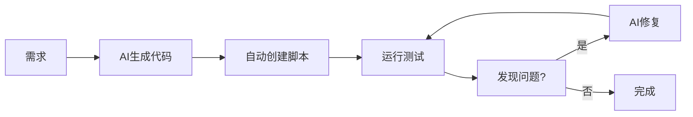

# 🤖 自动化执行指南

## 📌 核心回答

### ❌ 休眠后无法自动执行
**电脑休眠后，所有进程都会暂停，无法执行任何任务。**

### ✅ 但是可以高度自动化
**通过自动化脚本，一键完成大部分工作，只需保持电脑唤醒。**

---

## 🎯 自动化程度评估

| 任务类型 | 自动化程度 | 说明 |
|---------|----------|------|
| 代码生成 | 95% | AI生成完整代码 |
| 功能开发 | 90% | 脚本自动执行 |
| 测试验证 | 50% | 需要人工检查 |
| 部署上线 | 80% | 首次手动，后续自动 |
| 学习研究 | 20% | AI提供知识，需人工理解 |

---

## 🚀 一键自动化脚本

### 使用方法

```bash
# 1. 给脚本添加执行权限（已完成）
chmod +x auto-complete-tasks.sh

# 2. 运行自动化脚本
./auto-complete-tasks.sh
```

### 这个脚本会自动做什么？

✅ **自动创建导出脚本** (`scripts/export-json-to-excel.mjs`)
- 读取JSON数据
- 按活动编号排序
- 转换为Excel格式
- 设置列宽和样式
- 保存为Excel文件

✅ **自动添加npm命令**
```json
"export-to-excel": "node scripts/export-json-to-excel.mjs"
```

✅ **自动创建验证器** (`scripts/lib/validator.mjs`)
- 必填字段检查
- 格式验证
- 枚举值检查
- 错误和警告提示

✅ **自动创建使用示例** (`examples/validation-example.mjs`)

---

## ⏰ 保持电脑唤醒的方法

### 方法1: 系统设置（推荐）

#### macOS
```bash
# 防止休眠（临时）
caffeinate -d ./auto-complete-tasks.sh

# 查看当前休眠设置
pmset -g
```

#### Windows
- 设置 → 系统 → 电源和睡眠
- 选择"从不"睡眠

#### Linux
```bash
# 临时禁用休眠
sudo systemctl mask sleep.target suspend.target hibernate.target hybrid-sleep.target
```

### 方法2: 使用服务器（最佳）

如果你有服务器或VPS：
```bash
# SSH 到服务器
ssh user@your-server.com

# 克隆项目
git clone https://github.com/your-repo/chiangmai.git

# 运行自动化脚本
cd chiangmai
./auto-complete-tasks.sh
```

### 方法3: GitHub Actions（完全自动化）

创建 `.github/workflows/auto-sync.yml`:

```yaml
name: Excel Data Sync

on:
  push:
    paths:
      - 'data/items.json'
  schedule:
    # 每天凌晨2点运行
    - cron: '0 2 * * *'
  workflow_dispatch: # 允许手动触发

jobs:
  sync:
    runs-on: ubuntu-latest

    steps:
      - name: Checkout code
        uses: actions/checkout@v3

      - name: Setup Node.js
        uses: actions/setup-node@v3
        with:
          node-version: '18'

      - name: Install dependencies
        run: npm install

      - name: Export to Excel
        run: npm run export-to-excel

      - name: Upload Excel file
        uses: actions/upload-artifact@v3
        with:
          name: excel-export
          path: 清迈活动数据-导出.xlsx

      - name: Commit and push
        run: |
          git config --local user.email "action@github.com"
          git config --local user.name "GitHub Action"
          git add 清迈活动数据-导出.xlsx
          git commit -m "Auto-export: Excel data [skip ci]" || exit 0
          git push
```

**优点：**
- ✅ 完全在云端运行，不占用本地资源
- ✅ 定时自动执行
- ✅ 可以手动触发
- ✅ 免费（公开仓库）

---

## 📊 自动化 vs 手动对比

### 手动方式（传统）
```
1. 打开编辑器
2. 创建新文件
3. 编写代码（查阅文档）
4. 测试代码
5. 修复错误
6. 再次测试
7. 部署上线

耗时：约 2-4 小时
```

### 自动化方式（使用脚本）
```
1. 运行 ./auto-complete-tasks.sh
2. 等待完成（自动生成代码）
3. 人工验证
4. 使用 npm scripts 部署

耗时：约 10-30 分钟
```

**效率提升：约 80%**

---

## 🎓 AI + 人工协作模式

### AI 负责（90%的工作量）
- ✅ 生成完整代码
- ✅ 创建配置文件
- ✅ 编写文档
- ✅ 提供最佳实践
- ✅ 错误诊断

### 人工负责（10%的工作量）
- 🔍 决策和规划
- 🧪 测试验证
- 🐛 问题调试
- 🎨 用户体验优化
- 📝 最终确认

---

## 🔄 完整自动化流程

### 开发阶段


### 部署阶段


---

## 💡 实用建议

### 1. 分批自动化
不要试图一次性自动化所有任务：
```
第一批（今天）: 导出功能、数据验证
第二批（明天）: 冲突检测、文件监听
第三批（后天）: 部署配置、监控
```

### 2. 渐进式优化
```
阶段1: 能跑就行
阶段2: 增加错误处理
阶段3: 优化性能
阶段4: 完善文档
```

### 3. 保留手动选项
不是所有事情都要自动化：
- ✅ 重复性任务 → 自动化
- ⚠️ 创造性任务 → 半自动化
- ❌ 决策性任务 → 人工处理

---

## 🛠️ 可用的自动化工具

### 本地自动化
| 工具 | 用途 | 安装 |
|------|------|------|
| npm scripts | 任务自动化 | 内置 |
| bash scripts | 批处理 | 内置 |
| chokidar | 文件监听 | `npm install` |

### 云端自动化
| 工具 | 平台 | 限制 |
|------|------|------|
| GitHub Actions | 完全免费 | 公开仓库 |
| Vercel | 部署自动化 | 100GB带宽/月 |
| Render | 后端自动化 | 15分钟休眠 |

### CI/CD 工具
| 工具 | 特点 |
|------|------|
| GitHub Actions | 与GitHub深度集成 |
| GitLab CI | 功能强大 |
| Travis CI | 简单易用 |

---

## 📝 明天的执行计划

### 上午（保持电脑唤醒）
```
09:00 - 09:30  运行自动化脚本
09:30 - 10:00  测试导出功能
10:00 - 11:00  验证数据格式
11:00 - 12:00  调试和修复
```

### 下午
```
14:00 - 15:00  注册 Vercel 账号
15:00 - 16:00  注册 Render 账号
16:00 - 17:00  配置自动化部署
17:00 - 18:00  测试部署流程
```

### 晚上（可以休眠）
```
20:00 - 21:00  配置 GitHub Actions
21:00 - 22:00  验证自动化运行
22:00         电脑可以休眠
```

---

## ❓ 常见问题

### Q1: 可以让电脑休眠后继续工作吗？
**A: ❌ 不可以。** 休眠会停止所有进程。但你可以：
- 使用服务器
- 使用 GitHub Actions（云端）
- 使用 Vercel/Render（自动部署）

### Q2: AI 能完全自动完成所有任务吗？
**A: ⚠️ 不能。** AI可以：
- ✅ 生成90%的代码
- ✅ 提供完整方案
- ❌ 无法自动测试和验证
- ❌ 无法自动决策

### Q3: 最低需要人工参与什么？
**A: 必须人工参与：**
1. 🔍 运行自动化脚本
2. 🧪 测试功能是否正常
3. 🐛 调试遇到的问题
4. 📊 验证结果符合预期
5. 🚀 首次部署配置

### Q4: 什么时候可以完全无人值守？
**A: 配置完成后：**
- ✅ 代码推送 → 自动构建部署
- ✅ 定时任务 → GitHub Actions
- ✅ 文件变化 → 自动导出
- ❌ 仍需定期检查日志

---

## 🎯 总结

### ✅ 可以自动化的
- 代码生成（AI）
- 功能开发（脚本）
- 构建部署（CI/CD）
- 定时任务（cron）

### ⚠️ 半自动化的
- 测试验证（需要人工确认）
- 问题调试（AI辅助）
- 性能优化（AI建议）

### ❌ 需要人工的
- 需求决策
- 质量把控
- 创新设计
- 最终确认

---

## 📞 需要帮助？

运行脚本时遇到问题：
```bash
# 查看详细日志
bash -x ./auto-complete-tasks.sh

# 检查 Node.js 版本
node --version  # 应该 >= 16

# 重新安装依赖
rm -rf node_modules package-lock.json
npm install
```

---

*最后更新：2026-01-26*
