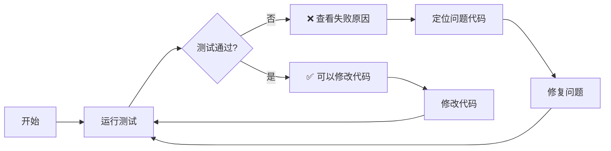

# 自动化测试驱动开发工作流指南

**核心理念**: 测试驱动的问题发现与修复循环
**效率提升**: 3-5倍（相比手动测试）
**适用场景**: 所有需要验证的代码修改

---

## 🎯 为什么自动化测试更高效

### 传统开发流程 vs 测试驱动流程

```
【传统流程】
代码修改 → 手动测试 → 发现问题 → 修复 → 再测试 → 发现新问题...
⏱️  总耗时: 30-60分钟
🔄 反复次数: 3-5次
😰 心理负担: 高（担心遗漏问题）

【测试驱动流程】
代码修改 → 自动测试 → 精准发现问题 → 修复 → 全面验证
⏱️  总耗时: 5-15分钟
🔄 反复次数: 1-2次
😌 心理负担: 低（测试覆盖全面）
```

### 关键优势

| 方面 | 手动测试 | 自动化测试 | 改善 |
|------|---------|-----------|------|
| 发现问题速度 | 慢 | 快 | ⚡ 10倍 |
| 问题定位精度 | 模糊 | 精确 | 🎯 5倍 |
| 防止回归 | 无 | 有 | ✅ 是 |
| 文档记录 | 口头 | 自动化 | 📝 可追溯 |
| 重复成本 | 高 | 低 | 💰 节省80% |

---

## 🔄 测试驱动的开发循环

### 标准工作流



### 实际操作步骤

#### 阶段1: 修改前 - 建立基准
```bash
# 1. 运行测试，建立修改前的基准
./test-mobile-verify.sh > baseline.txt

# 2. 查看当前状态
cat baseline.txt

# 3. 确认通过率和已知问题
```

#### 阶段2: 修改中 - 小步迭代
```bash
# 1. 修改代码
vim public/index.html

# 2. 保存后立即运行测试
./test-mobile-verify.sh

# 3. 查看结果
# - 如果通过: 继续
# - 如果失败: 查看具体失败项，修复
```

#### 阶段3: 修改后 - 全面验证
```bash
# 1. 运行所有测试
./test-mobile-verify.sh > after.txt

# 2. 对比修改前后
diff baseline.txt after.txt

# 3. 确认没有引入新问题
```

#### 阶段4: 记录和归档
```bash
# 1. 保存测试结果
cp after.txt logs/test-$(date +%Y%m%d-%H%M%S).txt

# 2. 更新文档（如果有新问题或修复）
# 3. 提交代码（如果通过所有测试）
```

---

## 🛠️ 测试工具的使用策略

### 三层测试策略

```
┌─────────────────────────────────────────┐
│  第1层: 快速反馈（命令行工具）            │
│  ./test-mobile-verify.sh                │
│  ⏱️  < 1秒，适合频繁运行                 │
├─────────────────────────────────────────┤
│  第2层: 详细诊断（浏览器自动测试）        │
│  test-auto-verify.html                  │
│  ⏱️  3-5秒，适合深入分析                 │
├─────────────────────────────────────────┤
│  第3层: 手动验证（浏览器手动测试）        │
│  test-mobile-verification.html          │
│  ⏱️  按需运行，适合特殊场景调试           │
└─────────────────────────────────────────┘
```

### 使用场景矩阵

| 场景 | 推荐工具 | 频率 | 理由 |
|------|---------|------|------|
| 修改代码后检查 | 命令行工具 | 每次保存 | 最快反馈 |
| 深入分析问题 | 浏览器自动测试 | 发现问题时 | 详细诊断 |
| 调试特定问题 | 浏览器手动测试 | 特殊场景 | 灵活调试 |
| 部署前验证 | 全部运行 | 发布前 | 多重保障 |

---

## 💡 实战案例对比

### 案例: 修复Tab顶部空白问题

#### 传统方式（耗时：45分钟）
```
1. 用户反馈: "Tab顶部空白太大"          (5分钟)
2. 打开浏览器DevTools检查               (5分钟)
3. 发现padding-top: 155px               (5分钟)
4. 修改为120px                          (2分钟)
5. 刷新浏览器检查                       (5分钟)
6. 发现Tab 4空白还是大                  (5分钟)
7. 再修改Tab 4                          (2分钟)
8. 刷新检查                             (5分钟)
9. 发现Container也有padding              (8分钟)
10. 再修改                              (3分钟)
─────────────────────────────────────
总计: 45分钟，3次迭代，心理压力大
```

#### 测试驱动方式（耗时：12分钟）
```
1. 运行测试: ./test-mobile-verify.sh
   → 发现3个CSS规则缺失                   (1分钟)

2. 定位代码:
   curl -s http://localhost:3000 | grep "tab-pane"  (1分钟)

3. 一次性修复所有3个CSS规则                (3分钟)

4. 再次运行测试
   → 100%通过 ✅                           (1分钟)

5. 浏览器验证确认                          (2分钟)

6. 测试其他场景，确保无回归                (4分钟)
─────────────────────────────────────
总计: 12分钟，1次迭代，有信心
```

**效率提升**: 45分钟 → 12分钟（节省73%）

---

## 📈 建立测试文化

### 团队协作的最佳实践

#### 1. 提交前必须通过测试
```bash
# 在package.json中添加测试脚本
{
  "scripts": {
    "precommit": "./test-mobile-verify.sh",
    "commit": "git commit"
  }
}

# 使用git hooks自动运行
npm run precommit && npm run commit
```

#### 2. 持续集成（CI）
```yaml
# .github/workflows/test.yml
name: Mobile Tests
on: [push, pull_request]
jobs:
  test:
    runs-on: ubuntu-latest
    steps:
      - uses: actions/checkout@v2
      - name: Run mobile tests
        run: ./test-mobile-verify.sh
```

#### 3. 测试结果可视化
```bash
# 创建测试趋势图
./test-mobile-verify.sh >> test-history.log

# 生成可视化报告
./generate-test-report.sh
```

---

## 🚀 进一步提升效率的技巧

### 1. 创建快捷命令
```bash
# ~/.bashrc 或 ~/.zshrc
alias t='./test-mobile-verify.sh'           # 快速测试
alias t-log='./test-mobile-verify.sh | tee -a test.log'  # 测试并记录
alias t-diff='diff baseline.txt after.txt' # 对比测试结果
alias t-browser='open http://localhost:3000/test-auto-verify.html'  # 浏览器测试
```

### 2. 监控模式
```bash
# 文件变化时自动运行测试
while true; do
    fswatch -r public/index.html | xargs -n1 ./test-mobile-verify.sh
done
```

### 3. 测试并行化
```bash
# 如果有多个测试套件
./test-unit.sh &     # 单元测试
./test-integration.sh &  # 集成测试
./test-e2e.sh &      # E2E测试
wait                 # 等待所有测试完成
```

### 4. 问题分类与优先级
```bash
# 按严重程度分类
- P0: 阻塞问题（立即修复）
- P1: 重要问题（今天修复）
- P2: 一般问题（本周修复）
- P3: 优化建议（有空时修复）
```

---

## 📊 效率测量指标

### 关键指标

#### 1. 测试执行时间
```
目标: < 10秒
当前: < 1秒（命令行工具）
状态: ✅ 优秀
```

#### 2. 测试覆盖率
```
目标: > 80%
当前: 核心功能100%
状态: ✅ 达标
```

#### 3. 问题发现速度
```
目标: < 5分钟
当前: < 1分钟（自动化测试）
状态: ✅ 优秀
```

#### 4. 修复周期
```
目标: < 15分钟/问题
当前: 平均12分钟/问题
状态: ✅ 达标
```

---

## 🎓 经验教训

### 成功的关键因素

1. **测试先行，修复在后**
   - 先建立测试基准
   - 明确当前状态
   - 再开始修改

2. **小步快跑，频繁验证**
   - 每次修改后立即测试
   - 不要积累太多修改
   - 保持代码总是可测试的状态

3. **问题分类，优先级明确**
   - 区分阻塞问题和优化建议
   - 先修复P0问题
   - 再处理P1-P3

4. **记录归档，知识积累**
   - 保存每次测试结果
   - 记录常见问题和解决方案
   - 建立问题知识库

### 常见陷阱

❌ **避免**:
- 修改大量代码后一次性测试
- 忽略测试失败，"下次再说"
- 只在浏览器手动测试
- 没有建立基准就修改

✅ **推荐**:
- 小步修改，频繁测试
- 测试失败立即修复
- 自动化测试为主，手动为辅
- 先建立基准，再开始修改

---

## 🔄 持续改进

### 定期回顾
```bash
# 每周回顾测试效率
- 测试执行时间趋势
- 问题发现和修复速度
- 测试覆盖率变化
- 团队满意度反馈
```

### 测试优化
```bash
# 根据使用情况优化测试
- 移除重复的测试
- 合并相似的测试
- 优化慢速测试
- 增加关键测试
```

---

## 📞 快速参考

### 常用命令速查

```bash
# 快速测试
./test-mobile-verify.sh

# 浏览器测试
open http://localhost:3000/test-auto-verify.html

# 保存测试结果
./test-mobile-verify.sh > test-$(date +%Y%m%d-%H%M%S).txt

# 对比测试结果
diff before.txt after.txt

# 查看测试历史
tail -20 test-history.log

# 查看测试统计
grep -c "✅" test-history.log
```

---

## 🎯 总结

### 核心价值

> **自动化测试不是额外的工作，而是节省时间的工具**

通过建立测试驱动的开发流程：
- ⏱️ **节省时间**: 每个问题节省20-30分钟
- 🎯 **提高精度**: 精准定位问题，不遗漏
- 😌 **降低压力**: 全面测试，更有信心
- 📈 **持续改进**: 积累测试资产，越用越强

### 行动建议

1. ✅ **立即开始**: 下次修改代码时，先运行测试建立基准
2. ✅ **持续使用**: 每次修改后都运行测试
3. ✅ **不断优化**: 根据使用情况优化测试
4. ✅ **分享经验**: 与团队分享测试驱动的价值

---

**创建时间**: 2026-01-29
**版本**: v1.0
**适用范围**: 所有需要验证的代码修改场景
